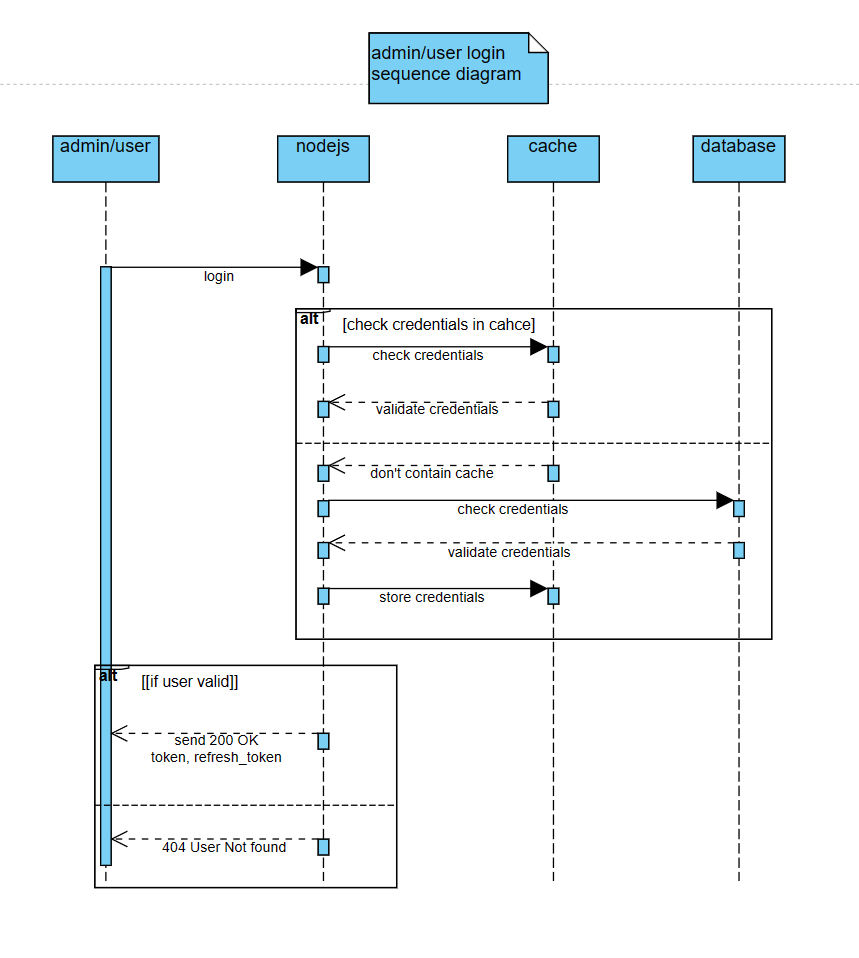
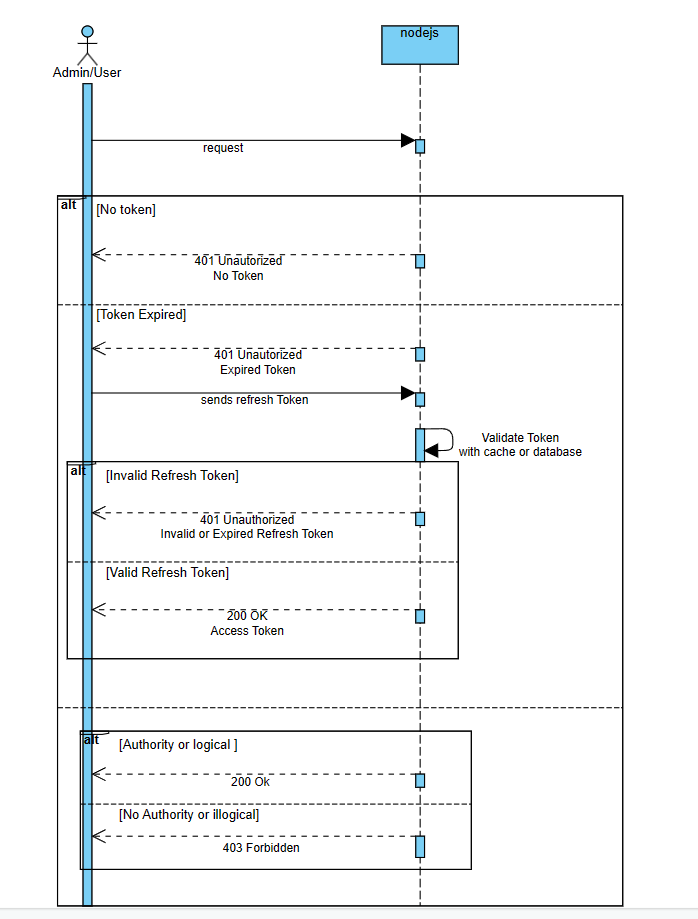
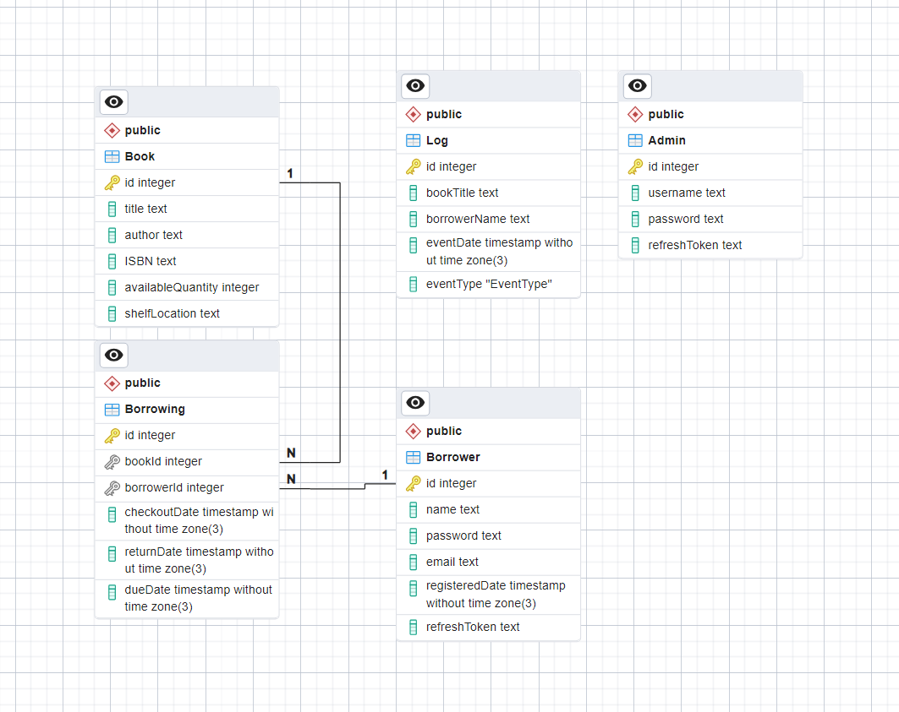

# Library-Management-System

Library Management System is a software built with Node.js and PostgreSQL to manage the operations of a library.

## Table of Contents

- [Prerequisites](#prerequisites)
- [Installing Library-Management-System](#installing-library-management-system)
- [User Interaction](#user-interaction)
- [Database Design](#database-design)
- [Security Measures](#security-measures)
- [Caching](#caching)
- [Authentication](#authentication)
- [API Documentation](#api-documentation)

## Prerequisites

Before you begin, ensure you have met the following requirements:

* You have installed the latest version of [Node.js](https://nodejs.org/en/download/) (v20.9.0 or later).
* You have a Windows/Linux/Mac machine.
* You have installed [PostgreSQL](https://www.postgresql.org/download/) (v16.1 or later).
*  You have Docker installed on your machine. You can download and install Docker from here [Docker](https://www.docker.com/products/docker-desktop/) (v4.26.0).

## Installing Library-Management-System

To install Library-Management-System, follow these steps:

1. Clone the repository:
```bash
git clone https://github.com/<your-username>/Library-Management-System.git
```

2. Navigate into the project directory:
```bash
cd Library-Management-System
```

3. Install the dependencies:
```bash
npm install
```

4. Start the PostgreSQL service (note for linux if using windows make sure the service is running).
```bash
sudo service postgresql start
```

5. Create a `.env` file *IN THE ROOT DIRECTORY* of your project to select the required port and set jwtsecret and REDIS_URL here the redis url and your default admin that gets created at first if not available:

```env
NODE_PORT=3000
ADMIN_JWT_SECRET=secret1
ADMIN_JWT_REFRESH_SECRET=secret1
USER_JWT_SECRET=secret2
USER_JWT_REFRESH_SECRET=secret2
REDIS_URL=redis://localhost:6379
DEFAULT_ADMIN_USERNAME=admin
DEFAULT_ADMIN_PASSWORD=admin
```

6. Modify the .env file in *IN THE DATABASE DIRECTORY* to point to your specific PostgreSQL database. Ensure that the DATABASE_URL aligns with the connection string of your database. Note that you should not create the database; simply provide the correct string, and Prisma will handle the table setup:

```env
DATABASE_URL=postgres://<username>:<password>@localhost/library-management-system
```

7. Setup the database schema using Prisma. Navigate to the database directory run the following command:

```bash
npx prisma db push
```

8. Setup redis on docker by running this command:

```bash
docker-compose up -d
```

9. Finally run the following command to start the application:
```bash
npm start
```

## User Interaction

1. Login Sequence



    
    1. The user initiates a login.

    2. The backend first verifies the credentials in the cache, responding accordingly if they are available and valid.
    
    3. If the credentials are not found or invalid in the cache, the backend checks them in the database.
    
    4. Upon validating the credentials in the database, the backend either stores them in the cache if valid or sends a 404 error if the user is not found.


2. User Request




    1. The user initiates a CRUD request.
    
    2. If no token is provided, the backend rejects the request with a 401 Unauthorized response.
    
    3. If a token is provided, the server checks its validity. If expired, a 401 Unauthorized response is sent; otherwise, the request proceeds.
    
    4. The user sends a refresh token, and the server checks its validity in the cache or database. If valid, a new access token is sent; if invalid or expired, a 401 Unauthorized response is returned.

    5. If the initial access token is valid, the request is processed. If the request is logical, the user has the necessary authority, and a 200 OK response is sent. In case of insufficient authority or illogical requests, a 403 Forbidden response is returned.


## Database Design



1. Admin

The Admin table is structured to oversee the system operations. When the system starts, a default admin is established using the credentials found in the .env file. The exclusive rights to add new admins, delete books, and view logs are reserved for admins. Additionally, this table stores a refresh token for enhanced security.

2. Borrower

The Borrower is intended for users who wish to create a profile for borrowing purposes. It collects their name, email, and password, along with a refresh token for added security.

3. Book

The Book table is structured to hold information about books, including details such as the author, title, ISBN, quantity, and shelf location for tracking purposes.

4. Borrowing

This table is designed to track the transactional borrowing operations performed by a borrower on a book. It records the 1-to-many relationship where a borrower can borrow from zero to 'N' number of books.

5. Log

This table is primarily established for analytical purposes, tracking the status of borrowed books - whether they have been returned or not - to facilitate operational tracking and historical analysis.


## Security Measures

1. Implemented basic JWT (JSON Web Token) authentication.

2. Utilized JOI for user input validation and sanitization.

3. Employed Prisma ORM to guard against SQL injection by ensuring variables are only entered in designated placeholders.


## Caching

Given that the system is more read-intensive than write-intensive, Redis was employed to enhance read operations and reduce the load on the database. An immediate write-to-database policy was implemented for edits in the cache to ensure data consistency.

## Authentication

Authentication is handled using JWT (JSON Web Token), with four distinct secrets: two for generating access tokens for admins and borrowers, and two more for creating their respective refresh tokens. The access token, which expires after 15 minutes, is required for any system operation performed by either an admin or a borrower.

## API Documentation 

### Admin Endpoints:

1. `POST /api/admin/login`
   - Description: Logs in an admin.
   - Middleware: Validates admin data.
   - Handler: `admin_handler.login_admin`

2. `GET /api/admin/refresh`
   - Description: Refreshes an admin's token.
   - Middleware: Validates refresh token.
   - Handler: `admin_handler.refresh_token`

3. `POST /api/admin/logout`
   - Description: Logs out an admin.
   - Handler: `admin_handler.logout_admin`

4. `POST /api/admin/register`
   - Description: Registers a new admin this can be invoked only by the default admin of the system.
   - Middleware: Validates admin data.
   - Handler: `admin_handler.register_admin`

5. `DELETE /api/admin/delete`
   - Description: Deletes an admin this can be invoked only by the default admin of the system.
   - Middleware: Validates admin data.
   - Handler: `admin_handler.delete_admin`


### Borrower Endpoints:

1. `POST /api/borrower/register`
   - Description: Registers a new borrower.
   - Middleware: Validates borrower registration data.
   - Handler: `borrower_handler.register_borrower`

2. `POST /api/borrower/login`
   - Description: Logs in a borrower.
   - Middleware: Validates borrower login data.
   - Handler: `borrower_handler.login_borrower`

3. `POST /api/borrower/refresh`
   - Description: Refreshes a borrower's token.
   - Middleware: Validates borrower refresh token and send a new access token.
   - Handler: `borrower_handler.refresh_token`

4. `POST /api/borrower/logout`
   - Description: Logs out a borrower.
   - Handler: `borrower_handler.logout_borrower`

5. `POST /api/borrower/edit`
   - Description: Edits a borrower's profile.
   - Middleware: Validates borrower edit data.
   - Handler: `borrower_handler.edit_borrower`

Note these routes are not allowed for admin access tokens


### Book Endpoints:

1. `GET /api/book/search?title=...&author=...&ISBN=...&available_quantity=...&shelf_located=...`
   - Description: Searches for books based on the provided query parameters.
   - Middleware: Checks if the requester is an admin or a borrower.
   - Handler: `book_handler.get_books`

2. `GET /api/book/:id`
   - Description: Retrieves a book by its ID.
   - Middleware: Checks if the requester is an admin or a borrower.
   - Handler: `book_handler.get_book`

3. `POST /api/book`
   - Description: Creates a new book.
   - Middleware: Checks if the requester is an admin.
   - Handler: `book_handler.create_book`

4. `PUT /api/book/:id`
   - Description: Updates a book by its ID.
   - Middleware: Checks if the requester is an admin.
   - Handler: `book_handler.update_book`

5. `DELETE /api/book/:id`
   - Description: Deletes a book by its ID.
   - Middleware: Checks if the requester is an admin.
   - Handler: `book_handler.delete_book`


### Logs Endpoints:

1. `GET /api/logs/get`
   - Description: Fetches logs based on the provided query parameters. This can be used for further analytics.
   - Middleware: Checks if the requester is an admin.
   - Request Body: 
     - `book_title`: Title of the book.
     - `borrower_name`: Name of the borrower.
     - `borrowed`: Whether the book was borrowed.
     - `returned`: Whether the book was returned.
     - `date_from`: Start date for the logs.
     - `date_to`: End date for the logs.
   - Response: A status of 200 and a JSON object containing a success message and the fetched logs.
   - Handler: `logs_model.get_logs`


